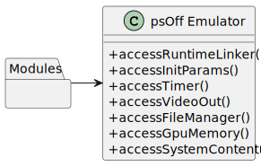

# Overview

Each target library is created separately as a shared library in the **modules** folder. This allows NIDs generation at build time and a clean code separation.

The Emulator loads the libraries on demand and resolves the symbols etc. A library does only communicate with the emulator.
If it should need information/calls from other libraries, a separate top class should be used. The library can link against it and access the interface.

Planned is a core library for such cases and for the interfaces currently in the emulator.

## Create a new module

* duplicate the *template* folder
* replace the folder with the *identical* name of the target library.
* inside *CMakeLists.txt*, replace template in "set(libName template)" with the library name
* inside *entry.cpp*, replace "libSce" both in LOG_DEFINE_MODULE() and MODULE_NAME = ""

All exported function are placed inside the provided extern "C" scope and should start with "EXPORT SYSV_ABI", since those functions are  called directly by the emulated application (linux).

> **_NOTE:_** The template only contains a dependency to the logging library as a bare minimum. To access the interfaces from the emulator, add the following line: \
target_link_libraries(${libName} PRIVATE emulator.lib)

After a new cmake config, the new library should be picked up and built.

> **_Build:_** dll2Nids may print an error. Just add a dummy function with a long name (11 + extra space). \
Only names starting with *sce* are converted currently. May change if needed, later.